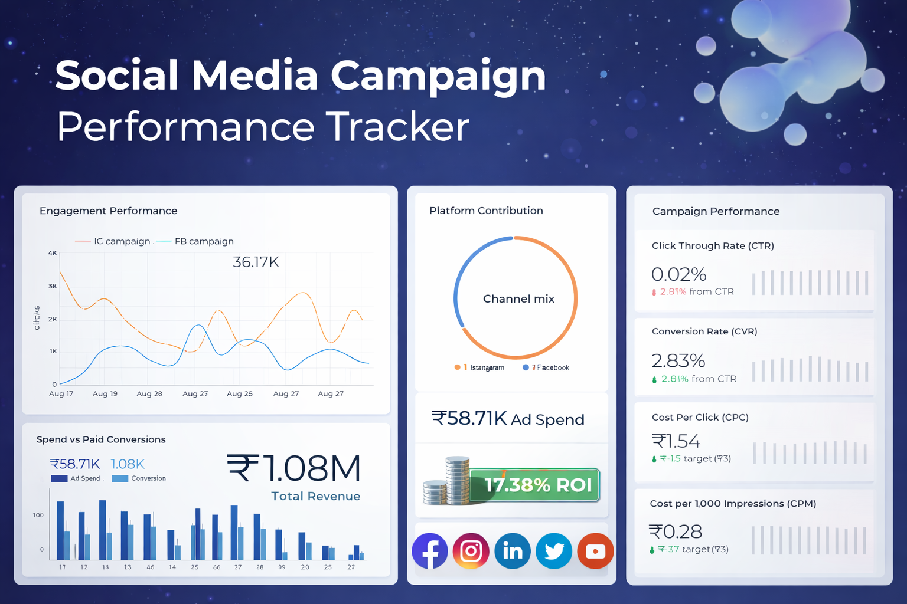

# FUTURE_DS_02
## Social Media Campaign Performance Tracker (Facebook/Instagram) 

Future Interns – Data Science & Analytics Internship (Task 2)

## Overview

This project is part of the Data Science & Analytics Internship (Task 2) by Future Interns.
The objective of this task was to analyze meta ads performance and build an interactive dashboard that helps answer key business questions around campaign effectiveness, engagement, and return on investment (ROI).

The analysis simulates a real world marketing analytics workflow using Facebook and Instagram ads data.

## Business Questions Addressed

The dashboard and analysis focus on answering the following:
1. How well did the ad campaign perform overall?
2. Which ads had the highest engagement?
3. What were the Click Through Rate (CTR) and Return on Investment (ROI)?
4. What can be improved for the next campaign?

## Dataset

Simulated/exported social media ads dataset (Facebook & Instagram) from Kaggle.com

Key fields include:
**Impressions**
**Clicks**
**Spend**
**Approved Conversions**
**Campaign / Ad IDs**
**Audience dimensions (age, gender, interests)**

⚠️ Revenue was not originally present in the dataset and was estimated amount of 1k rupees using an assumed product price for ROI calculation (clearly documented below).

## Data Cleaning & Prep
To enhance usability and storytelling:

1. Added IG campaign id column
2. Campaign Id mixed with gender
3. clean and prepared a new sheet 

## Key Metrics Calculated

All metrics were calculated using industry standard formulas:
**CTR (Click-Through Rate)**
CTR = Total Clicks / Total Impressions

**Conversion Rate (CVR)**
CVR = Approved Conversions / Clicks

**CPC (Cost Per Click)**
CPC = Ad Spend / Clicks

**CPM (Cost per 1,000 Impressions)**
CPM = (Ad Spend / Impressions) × 1000

**Estimated Revenue**
Revenue = Approved Conversions × ₹1,000 (assumption)

**ROI (Return on Investment)**
ROI = (Revenue − Spend) / Spend

📌 Note: Revenue and ROI values are directional estimates, based on an assumed single product price. They are used to demonstrate ROI analysis methodology.

## Dashboard Structure

The final dashboard was built using Google Looker Studio and organized into the following sections:

1. Overview
2. Facebook Specific Analysis
3. Instagram Specific Analysis
4. ROI & Investment Analysis
5. Executive Summary

## Key Insights

The campaign performed profitably within budget, generating an estimated ₹1.08M in revenue from ₹58.71K ad spend. Facebook emerged as the stronger conversion and ROI driver, contributing:

- 71.2% of total ROI
- 63.9% of total profit margin

Instagram delivered higher engagement volume but lower conversion efficiency. Overall CTR was 0.02%, which is low in absolute terms but acceptable for broad reach paid campaigns when paired with strong conversion outcomes.

## Recommendations

**Based on the analysis:**
- Reallocate more budget toward Facebook, where ROI and profit contribution are higher.
- Use Instagram primarily for awareness, not conversion led objectives.
- Refresh creatives mid campaign to address CTR decline.
- Track actual revenue per conversion in future campaigns for more accurate ROI analysis.

## Tools Used
- Google Looker Studio – Dashboard creation & visualization
- Google Sheets – Data cleaning and calculations
- Slides – Executive summary documentation

## Links
- Live Dashboard & Executive Summary Report: https://lookerstudio.google.com/u/0/reporting/8202b440-214d-4324-a922-3bb13fbaf0b8/page/iUjmF
- Data source: https://www.kaggle.com/datasets/madislemsalu/facebook-ad-campaign
- Dataset: https://docs.google.com/spreadsheets/d/1BlYP67-iw3v1pIJKK-QpDQVS-yH8fZc90qEZSRHKi-Y/edit?usp=sharing
